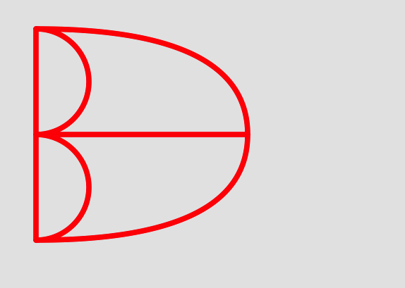
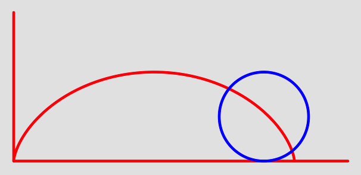
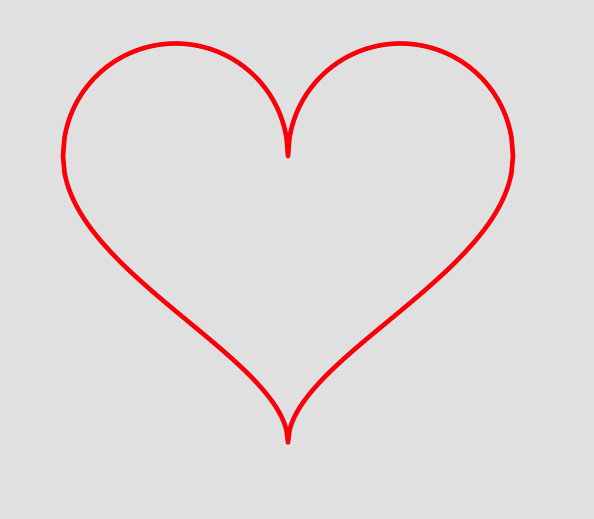
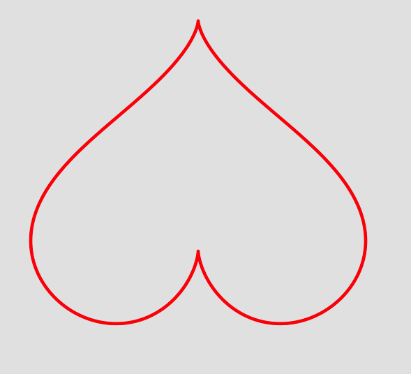
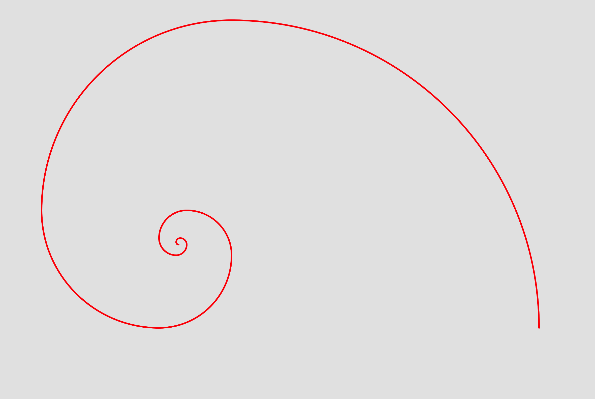
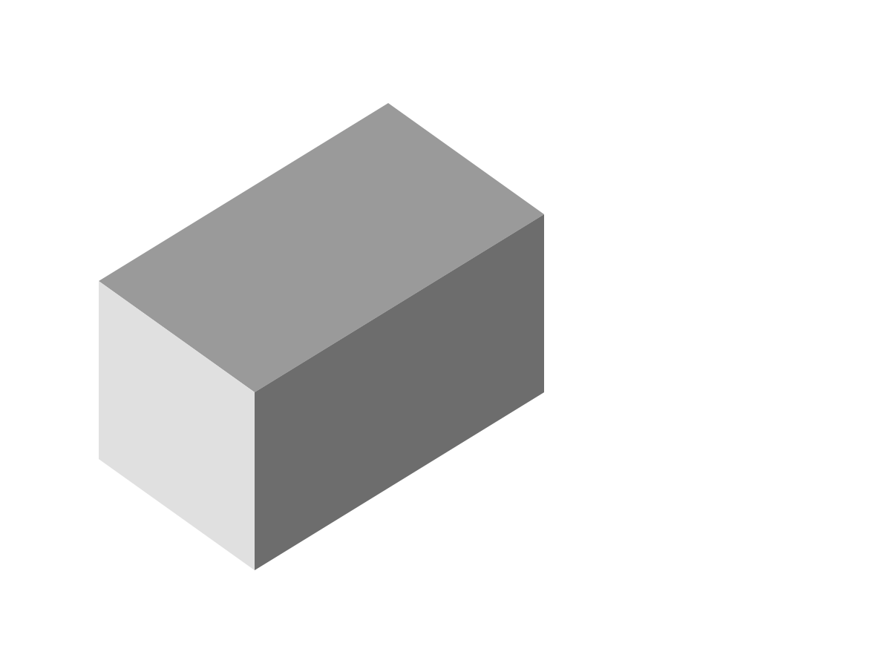

--
> 创建日期：2017年07月02日  
> 修改日期：2018年01月29日  

--
CoreGraphics框架中的UIBezierPath类可以创建由直线段和曲线段组成的各种图形，例如各类曲线、多边形、椭圆形，甚至可以创建平面三维图形。

###UIBezierPath基础
UIBezierPath对象是一个图形的完整绘画路径，使用直线和曲线来创建。直线可以创建多边形，曲线创建弧、椭圆形和曲边形，直线和曲线创建复杂图形。
所有的图形都是由多个点和多条线组成的，而UIBezierPath对象定义了一个图形中点和线的连接顺序从而构成图形。

利用UIBezierPath创建图形的步骤：

* 创建一个UIBezierPath对象
* 设置初始线段起点
* 创建直线或曲线绘图路径
* 设置UIBezierPath对象的绘画属性
* 开始绘图

**将现实世界中的诸事进行观察、思考，发现其中的规律，通过另一种语言表述出来，这就是编程。**

###UIBezierPath注意事项

1、UIBezierPath类是继承自NSObject，创建UIBezierPath对象并不会在视图中自动绘制图形。UIView类中有一个系统自带的方法：

```objc
- (void)drawRect:(CGRect)rect
```
这个系统方法默认没有任何内容，重写这个系统方法即可在视图中绘制图形。

2、复杂的图形可以由简单的图形组成。

3、可以绘制简单的三维立体图形。

###UIBezierPath绘图实例

####哥尼斯堡七桥图

创建视图类继承自UIView并初始化子类

```objc
-(instancetype)initWithFrame:(CGRect)frame {
    self = [super initWithFrame:frame];
    if (self) {
        [self drawRect:frame];
    }
    return self;
}
```

开始画图，其中各个点的位置是自己定位的

```objc
- (void)drawRect:(CGRect)rect {
    
    CGPoint point0 = CGPointMake(250,150);//最右侧的点
    
    //纵向上的三个点
    CGPoint point1 = CGPointMake(50, 50);
    CGPoint point2 = CGPointMake(50, 150);
    CGPoint point3 = CGPointMake(50, 250);
    
    //两条弧段的控制点
    CGPoint controlPoint1 = CGPointMake(250, 50);
    CGPoint controlPoint2 = CGPointMake(250, 250);
    
    
    //左侧纵线
    UIBezierPath *aBezierPath = [UIBezierPath bezierPath];
    
    [aBezierPath moveToPoint:point1];
    [aBezierPath addLineToPoint:point3];
    
    aBezierPath.lineWidth = 5.0;
    aBezierPath.lineCapStyle = kCGLineCapRound;
    aBezierPath.lineJoinStyle = kCGLineJoinRound;
    [[UIColor redColor] setStroke];
    [aBezierPath stroke];
    
    
    //中间的横线
    UIBezierPath *bBezierPath = [UIBezierPath bezierPath];
    
    [bBezierPath moveToPoint:point2];
    [bBezierPath addLineToPoint:point0];
    
    bBezierPath.lineWidth = 5.0;
    bBezierPath.lineCapStyle = kCGLineCapRound;
    bBezierPath.lineJoinStyle = kCGLineJoinRound;
    [[UIColor redColor] setStroke];
    [bBezierPath stroke];
    
    
    //两个半圆
    UIBezierPath *dBezierPath = [UIBezierPath bezierPathWithArcCenter:CGPointMake(50, 100) radius:50.0 startAngle:(-M_PI_2) endAngle:M_PI_2 clockwise:YES];
    
    dBezierPath.lineWidth = 5.0;
    dBezierPath.lineCapStyle = kCGLineCapRound;
    dBezierPath.lineJoinStyle = kCGLineJoinRound;
    [[UIColor redColor] setStroke];
    [dBezierPath stroke];
    
    
    UIBezierPath *eBezierPath = [UIBezierPath bezierPathWithArcCenter:CGPointMake(50, 200) radius:50.0 startAngle:(-M_PI_2) endAngle:M_PI_2 clockwise:YES];
    
    eBezierPath.lineWidth = 5.0;
    eBezierPath.lineCapStyle = kCGLineCapRound;
    eBezierPath.lineJoinStyle = kCGLineJoinRound;
    [[UIColor redColor] setStroke];
    [eBezierPath stroke];
    
    
    //两条弧线
    UIBezierPath *fBezierPath = [UIBezierPath bezierPath];
    
    [fBezierPath moveToPoint:point1];
    [fBezierPath addQuadCurveToPoint:point0 controlPoint:controlPoint1];
    
    fBezierPath.lineWidth = 5.0;
    fBezierPath.lineCapStyle = kCGLineCapRound;
    fBezierPath.lineJoinStyle = kCGLineJoinRound;
    [[UIColor redColor] setStroke];
    [fBezierPath stroke];
    
    
    UIBezierPath *gBezierPath = [UIBezierPath bezierPath];
    
    [gBezierPath moveToPoint:point3];
    [gBezierPath addQuadCurveToPoint:point0 controlPoint:controlPoint2];
    
    gBezierPath.lineWidth = 5.0;
    gBezierPath.lineCapStyle = kCGLineCapRound;
    gBezierPath.lineJoinStyle = kCGLineJoinRound;
    [[UIColor redColor] setStroke];
    [gBezierPath stroke];
    
}
```

效果图



####摆线(圆滚线、旋轮线)
摆线的方程式为：

```
x = r * (𝛉 - sin𝛉)  
y = r * (1 - cos𝛉)
```

同样的创建视图类继承自UIView并初始化子类

```objc
-(instancetype)initWithFrame:(CGRect)frame {
    self = [super initWithFrame:frame];
    if (self) {
        [self drawRect:frame];
    }
    return self;
}
```

方程式中出现了三角函数，因此需要将角度换算为弧度，使用宏定义即可

```objc
#define DEGREE_TO_RADIAN(degree)  ((M_PI * degree) / 180) //角度转弧度
```

开始画图

```objc
- (void)drawRect:(CGRect)rect {
    
    CGFloat valueX = 0;//X值
    CGFloat valueY = 0;//Y值
    CGFloat valueRadius = 50;//半径
    CGFloat valueRadian = 0;//弧度
    
    
    CGPoint point0 = CGPointMake(20,(rect.size.height-20));//起点在左下角
    
    //开始画摆线
    UIBezierPath *aBezierPath = [UIBezierPath bezierPath];
    
    [aBezierPath moveToPoint:point0];
    
    for (int i = 0; i < 360; i++) {
        
        valueRadian = DEGREE_TO_RADIAN(i);
        valueX = valueRadius * (valueRadian - sin(valueRadian)) + 20;
        valueY = rect.size.height -(valueRadius * (1 - cos(valueRadian)) + 20);
        
        [aBezierPath addLineToPoint:CGPointMake(valueX, valueY)];
    }
    
    aBezierPath.lineWidth = 3.0;
    aBezierPath.lineCapStyle = kCGLineCapRound;
    aBezierPath.lineJoinStyle = kCGLineJoinRound;
    [[UIColor redColor] setStroke];
    [aBezierPath stroke];
    
    //画Y轴
    UIBezierPath *yBezierPath = [UIBezierPath bezierPath];
    
    [yBezierPath moveToPoint:point0];
    [yBezierPath addLineToPoint:CGPointMake(20, 20)];
    
    yBezierPath.lineWidth = 3.0;
    yBezierPath.lineCapStyle = kCGLineCapRound;
    yBezierPath.lineJoinStyle = kCGLineJoinRound;
    [[UIColor redColor] setStroke];
    [yBezierPath stroke];
    
    
    //画X轴
    UIBezierPath *xBezierPath = [UIBezierPath bezierPath];
    
    [xBezierPath moveToPoint:point0];
    [xBezierPath addLineToPoint:CGPointMake((rect.size.width-20), (rect.size.height-20))];
    
    xBezierPath.lineWidth = 3.0;
    xBezierPath.lineCapStyle = kCGLineCapRound;
    xBezierPath.lineJoinStyle = kCGLineJoinRound;
    [[UIColor redColor] setStroke];
    [xBezierPath stroke];
    
    
    //摆线上的基准圆
    UIBezierPath *circleBezierPath = [UIBezierPath bezierPathWithArcCenter:CGPointMake(300, (rect.size.height-valueRadius-20)) radius:valueRadius startAngle:0 endAngle:(2*M_PI) clockwise:YES];
    
    circleBezierPath.lineWidth = 3.0;
    circleBezierPath.lineCapStyle = kCGLineCapRound;
    circleBezierPath.lineJoinStyle = kCGLineJoinRound;
    [[UIColor blueColor] setStroke];
    [circleBezierPath stroke];
}
```

效果图



####笛卡尔心形线
笛卡尔心形线有多种形式，这里只展示两种公式的画法，对应的图形是心形线和桃形线，但其方法和思想都是一致的。

第一种 心形线

公式为

```
上部图形    y = sqrt(2 * sqrt(x * x) - x * x)           >>>  x取值范围为[-2,2]
下部图形    y = (-2.14) * sqrt(sqrt(2) - sqrt(abs(x)))  >>>  x取值范围为[-2,2]
```

同样的创建视图类继承自UIView并初始化子类，但是这里注意到x的取值范围为[-2,2]，需要对坐标系根据视图的范围进行转换

```objc
CGFloat transforms;
-(instancetype)initWithFrame:(CGRect)frame {
    self = [super initWithFrame:frame];
    if (self) {
        [self drawRect:frame];
        transforms = frame.size.height;
    }
    return self;
}
```

开始画图

```objc
- (void)drawRect:(CGRect)rect {
    
    CGFloat valueX = -150;
    CGFloat upperY = 0;
    CGFloat lowerY = 0;
    
    CGPoint point0 = CGPointMake(50,transforms - 300);//坐标系的转换
    
    //根据公式，分两部分画图
    UIBezierPath *aBezierPath = [UIBezierPath bezierPath];
    [aBezierPath moveToPoint:point0];
    
    UIBezierPath *bBezierPath = [UIBezierPath bezierPath];
    [bBezierPath moveToPoint:point0];
    
    for ( ; valueX <= 150; valueX++) {
        
        double operand = 2 * (valueX / 150);//将x的取值范围转换为[-2,2]，
        
        upperY = sqrt(2 * sqrt(operand * operand) - operand * operand);
        [aBezierPath addLineToPoint:CGPointMake(valueX+200, transforms - (75*upperY+300))];//平移坐标系(200,300)后翻转
        
        lowerY = (-2.14) * sqrt(sqrt(2) - sqrt(fabs(operand)));
        [bBezierPath addLineToPoint:CGPointMake(valueX+200, transforms - (75*lowerY+300))];//平移坐标系(200,300)后翻转
        
    }
    
    aBezierPath.lineWidth = 3.0;
    aBezierPath.lineCapStyle = kCGLineCapRound;
    aBezierPath.lineJoinStyle = kCGLineJoinRound;
    [[UIColor redColor] setStroke];
    [aBezierPath stroke];
    
    bBezierPath.lineWidth = 3.0;
    bBezierPath.lineCapStyle = kCGLineCapRound;
    bBezierPath.lineJoinStyle = kCGLineJoinRound;
    [[UIColor redColor] setStroke];
    [bBezierPath stroke];
}
```

效果图



第二种 桃形线

公式为

```
x = 16 * pow(sin t, 3)
y = 13 * cos t - 5 * cos 2t - 2 * cos 3t - cos 4t
```

同样的创建视图类继承自UIView并初始化子类

```objc
-(instancetype)initWithFrame:(CGRect)frame {
    self = [super initWithFrame:frame];
    if (self) {
        [self drawRect:frame];
    }
    return self;
}
```

方程式中出现了三角函数，因此需要将角度换算为弧度，同样的使用宏定义

```objc
#define DEGREE_TO_RADIAN(degree)  ((M_PI * degree) / 180) //角度转弧度
```

开始做图

```objc
- (void)drawRect:(CGRect)rect {
    
    CGFloat valueX = 0;
    CGFloat valueY = 0;
    CGFloat point0 = CGPointMake(200,250);
    
    UIBezierPath *cBezierPath = [UIBezierPath bezierPath];
    [cBezierPath moveToPoint:point0];
    
    //t取值范围为[0,360]
    for (int t = 0; t < 360;t++) {
        
        double radian = DEGREE_TO_RADIAN(t);
        
        valueX = 16 * pow(sin(radian), 3);
        valueY = 13 * cos(radian) - 5 * cos(2 * radian) - 2 * cos(3 * radian) - cos(4 * radian);
        
        [cBezierPath addLineToPoint:CGPointMake(10*valueX + 200, 10*valueY + 200)];//平移坐标系
    }
    
    cBezierPath.lineWidth = 3.0;
    cBezierPath.lineCapStyle = kCGLineCapRound;
    cBezierPath.lineJoinStyle = kCGLineJoinRound;
    [[UIColor redColor] setStroke];
    [cBezierPath stroke];
}
```

效果图



####斐波那契螺旋线

斐波那契数列形成的螺旋线。斐波那契数列通用公式为

    f(0) = 1;
    f(1) = 1;
    f(n) = f(n-1) + f(n-2); 

这个图形画起来还是有点复杂的，主要是梳理清楚画图的步骤。

第一步，画四分之一圆弧

以笛卡尔坐标系为基准，圆弧落在四个象限内，因此先要画图四个象限内的四分之一圆弧。

定义一个四象限结构体

```objc
 enum Sector {
    AlphaQuadrant  = 0,//第一象限
    BetaQuadrant   = 1,//第二象限
    GammaQuadrant  = 2,//第三象限
    DeltaQuadrant  = 3,//第四象限
};
typedef enum Sector Sector;
```

根据象限画四分之一圆弧

```objc
- (UIBezierPath *)drawQuadrantWithCenter:(CGPoint)center radius:(CGFloat)radius sector:(Sector)sector {
    return [UIBezierPath bezierPathWithArcCenter:center radius:radius startAngle:(sector * M_PI_2) endAngle:((sector + 1) * M_PI_2) clockwise:YES];
}
```

第二步，确定各个圆弧对应的半径大小

其实就是Fibonacci数列

```objc
-(NSInteger)fibonacci: (NSInteger)index {
    if (index < 1) {
        return 0;
    }
    if (index == 1 || index == 2) {
        return 1;
    }
    return ([self fibonacci:index-1]+[self fibonacci:index-2]);
}
```

第三步，确定圆弧圆心并画图

确定圆弧对应的圆心，根据圆心和半径画螺旋线。

```objc
- (void)drawRect:(CGRect)rect {
    CGFloat valueRadius = 0;//半径
    CGPoint point0 = CGPointMake(rect.size.width/2, rect.size.height/2);//螺线线中心点
    CGFloat valueX = point0.x-300;//X值 由于12.9寸iPad显示不全 图形向左平移300
    CGFloat valueY = point0.y;//Y值
    
    //显示原因 从斐波那契数列第5个开始到第16个结束
    for (int i = 5; i < 16; i++) {
        //半径
        valueRadius = [self fibonacci:i];
        //螺旋线顺时针对应的各个圆心
        NSInteger step = [self fibonacci:i] - [self fibonacci:i-1];//各个圆弧对应圆点的差
        if (i%4 == 0) {
            valueX -= step;
        }
        if (i%4 == 1) {
            valueY -= step;
        }
        if (i%4 == 2) {
            valueX += step;
        }
        if (i%4 == 3) {
            valueY += step;
        }
        
        UIBezierPath *aBezierPath = [self drawQuadrantWithCenter:CGPointMake(valueX, valueY) radius: valueRadius sector:i%4];
        
        aBezierPath.lineWidth = 3.0;
        aBezierPath.lineCapStyle = kCGLineCapRound;
        aBezierPath.lineJoinStyle = kCGLineJoinRound;
        
        [[UIColor redColor] set];
        [aBezierPath stroke];
    }
}
```

效果图



附：这里的螺旋线是顺时针方向的，同样也可以是逆时针方向的。


####三维立体图

创建简单的三维立体图形，直接上代码

```objc
- (void)drawRect:(CGRect)rect {
    CGPoint pointA = CGPointMake(180, 50);
    CGPoint pointB = CGPointMake(250, 100);
    CGPoint pointC = CGPointMake(120, 180);
    CGPoint pointD = CGPointMake(50, 130);
    CGPoint pointE = CGPointMake(50, 210);
    CGPoint pointF = CGPointMake(120, 260);
    CGPoint pointG = CGPointMake(250, 180);
    
    UIBezierPath *abcd = [UIBezierPath bezierPath];
    [abcd moveToPoint:pointA];
    [abcd addLineToPoint:pointB];
    [abcd addLineToPoint:pointC];
    [abcd addLineToPoint:pointD];
    abcd.lineWidth = 3.0;
    abcd.lineCapStyle = kCGLineCapRound;
    abcd.lineJoinStyle = kCGLineJoinRound;
    [[UIColor lightGrayColor] setFill];
    [abcd fill];
    
    UIBezierPath *bcfg = [UIBezierPath bezierPath];
    [bcfg moveToPoint:pointB];
    [bcfg addLineToPoint:pointC];
    [bcfg addLineToPoint:pointF];
    [bcfg addLineToPoint:pointG];
    bcfg.lineWidth = 3.0;
    bcfg.lineCapStyle = kCGLineCapRound;
    bcfg.lineJoinStyle = kCGLineJoinRound;
    [[UIColor grayColor] setFill];
    [bcfg fill];
    
    UIBezierPath *cdef = [UIBezierPath bezierPath];
    [cdef moveToPoint:pointC];
    [cdef addLineToPoint:pointD];
    [cdef addLineToPoint:pointE];
    [cdef addLineToPoint:pointF];
    cdef.lineWidth = 3.0;
    cdef.lineCapStyle = kCGLineCapRound;
    cdef.lineJoinStyle = kCGLineJoinRound;
    [[UIColor colorWithWhite:0.9 alpha:1] setFill];
    [cdef fill];
}
```

效果图


