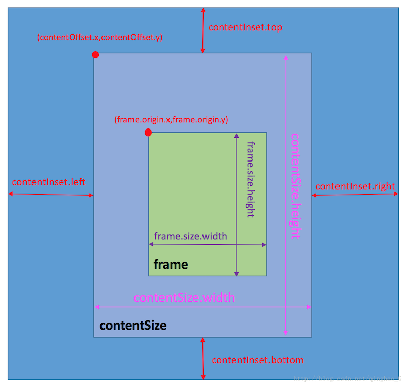

--
> 创建日期：2017年06月04日  
> 修改日期：2018年01月29日  

--
UIScrollView有三个属性，分别为**contentSize**、**contentOffset**、**contentInset**，再加上UIView的属性**frame**，一共是四个属性。

UIScrollView的四个属性在官方文档中是这样的：

```objc
/* 
use bounds/center and not frame if non-identity transform. 
if bounds dimension is odd, center may be have fractional part 
*/
@property(nonatomic)    CGRect  frame;

// default CGSizeZero
@property(nonatomic)    CGSize  contentSize;

// default CGPointZero
@property(nonatomic)    CGPoint contentOffset;

// default UIEdgeInsetsZero. add additional scroll area around content
@property(nonatomic)    UIEdgeInsets    contentInset;
```

##frame

frame是scrollView视图的位置和大小，为一个矩形框，数据类型为CGRect。

frame数据类型为CGRect，有四个参数值，分别为

* frame.origin.x: 表示视图位置原点的x值
* frame.origin.y: 表示视图位置原点的y值
* frame.size.width: 表示视图的宽度
* frame.size.height: 表示视图的高度

##contentSize

contentSize是scrollView需要显示的内容大小，是一个矩形框，因为contentSize是可以滚动的，因此只有大小而没有位置，数据类型为CGSize。

contentSize数据类型为CGSize，只有两个参数，分别为

* contentSize.width: 表示显示内容的宽度
* contentSize.height: 表示显示内容的高度

##contentOffset

contentOffset是scrollView的contentSize的原点相对于frame原点的偏移量，是两个点之间的相对值，数据类型为CGPoint。

contentOffset数据类型为CGPoint，只有两个参数，分别为

* contentOffset.x: 表示contentSize在x方向上的偏移量(有正负值)
* contentOffset.y: 表示contentSize在y方向上的偏移量(有正负值)

##contentInset

contentInset是scrollView的contentSize相对于自身四个边框的显示范围变化值，数据类型为UIEdgeInsets。

contentInset数据类型为UIEdgeInsets，有四个参数，分别为

* contentInset.top: 表示contentSize上边距显示范围变化值(有正负值)
* contentInset.bottom: 表示contentSize下边距显示范围变化值(有正负值)
* contentInset.left: 表示contentSize左边距显示范围变化值(有正负值)
* contentInset.right: 表示contentSize右边距显示范围变化值(有正负值)

##frame、contentSize、contentOffset、contentInset四者之间的关系

frame、contentSize、contentOffset、contentInset四者之间存在着一定的关系，见下图。
