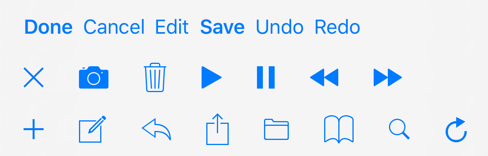

--
> 创建日期：2017年07月23日  
> 修改日期：2018年01月29日  

--
iOS系统中自带的UIBarButtonItem样式预览

```
UIBarButtonSystemItemDone,
UIBarButtonSystemItemCancel,
UIBarButtonSystemItemEdit,
UIBarButtonSystemItemSave,
UIBarButtonSystemItemUndo,
UIBarButtonSystemItemRedo,

UIBarButtonSystemItemStop,
UIBarButtonSystemItemCamera,
UIBarButtonSystemItemTrash,
UIBarButtonSystemItemPlay,
UIBarButtonSystemItemPause,
UIBarButtonSystemItemRewind,
UIBarButtonSystemItemFastForward,

UIBarButtonSystemItemAdd,
UIBarButtonSystemItemCompose,
UIBarButtonSystemItemReply,
UIBarButtonSystemItemAction,
UIBarButtonSystemItemOrganize,
UIBarButtonSystemItemBookmarks,
UIBarButtonSystemItemSearch,
UIBarButtonSystemItemRefresh,
```

对应的样式为

