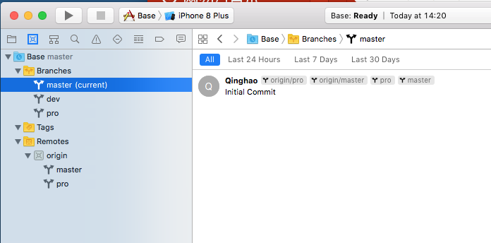

--
> 创建日期：2018年03月04日  
> 修改日期：2018年03月04日  

--
#Xcode 开发版本管理

### 版本管理场景

首先，创建一个根项目，命名为Seed项目，配置项目文件，采用 cocoapods 引入第三方库。在这个根项目中可以添加自己的组件、类别、动态库或静态库。所有的项目都是基于这个根项目产生的。

其次，根项目创建分支，该分支属于项目的根，根项目和项目的根是父子关系。在项目的根下创建项目开发分支，分**开发分支(develop)**、**测试分支(beta)**、**发布分支(release)**。

> 注：项目的根及分支不允许合并到根项目中，但是可以提交代码到根项目中。

### git 分支之间相互提交

### Xcode 分支切换

