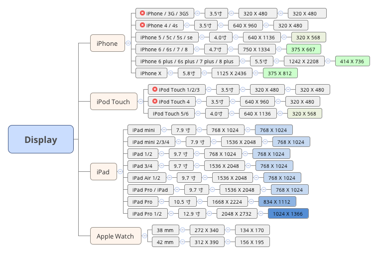
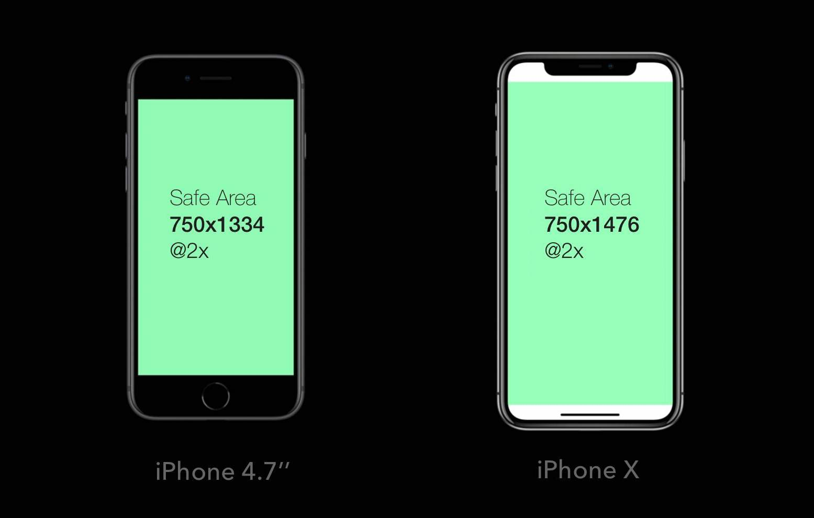
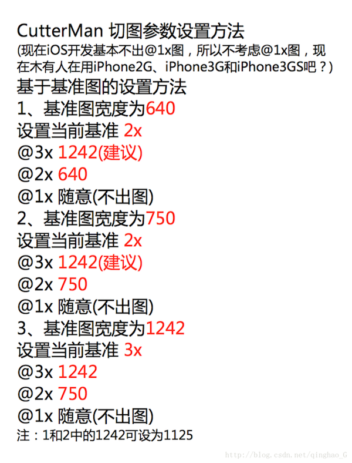

--
> 创建日期：2017年04月13日  
> 修改日期：2018年02月12日  

--
北京时间 2017 年 9 月 13 日凌晨，Apple 在 iPhone 十周年发布会上发布十年之作 iPhone X 。除了 iPhone X ，此次发布会带来的还有 iPhone 8 / 8 plus 。

新款 iPhone X 屏幕为全面屏(异形屏)，屏幕尺寸为 5.8 寸，屏幕分辨率为 1125 x 2436 ，屏幕物理分辨率为 375 x 812 ，这样 iPhone 屏幕适配又多出来一种尺寸。

### iPhone 屏幕适配
--
iPhone 屏幕总共有 5 种尺寸，尺寸大小分别为 3.5 寸、4.0 寸、4.7 寸、5.5 寸、5.8 寸，对应的屏幕物理分辨率分别为 320 x 480 、320 x 568 、375 x 667 、414 x 736、375 x 812，其中 320 x 480 的设备已经不再支持。

iPhone 屏幕尺寸有三种规格，分别是 @1x 图、@2x 图、@3x 图，其中使用 @1x 图的设备已经不再支持。

因此 iPhone 屏幕的宽度有三种，高度有四种，但是其中新版 iPhone X 的屏幕分布与其他 iPhone 屏幕不太一样。

### 适配原则
--
1. 流式布局

2. 控件弹性

3. 等比缩放

### 切图方法
-- 
1、切图只需要两套图，一套是@2x，一套是@3x。
 
2、切图时@2x图最好采用屏幕宽度750来计算。 

3、屏幕宽度有三种，320 、375 、414 。切图时，所需图片的宽度不是适配屏幕宽度的话，@3x 图的尺寸是 @2x 的 1.5 倍，利用 CutterMan 切图时，只需要设置 @3x 的基准值为 1125 即可；
如果切图的宽度等于屏幕的宽度(例如导航栏背景图、引导图、闪屏图、背景图等)，这时 @3x 图和 @2x 图的关系不是 1.5 倍。利用 CutterMan 切图时，需要设置 @3x 的基准值为 1242 。 

