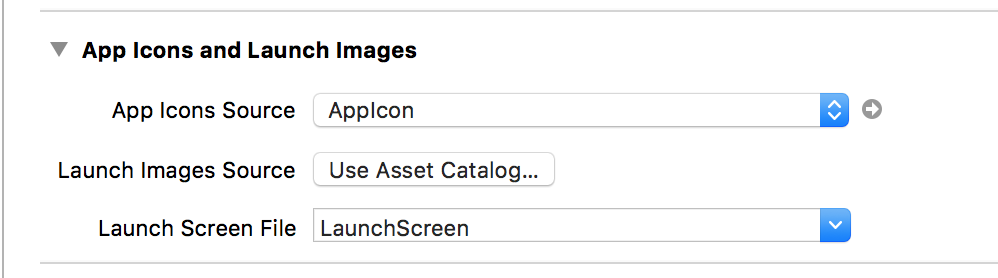
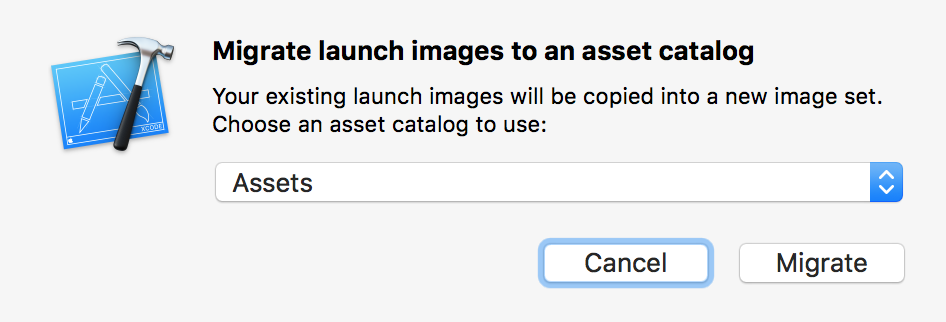
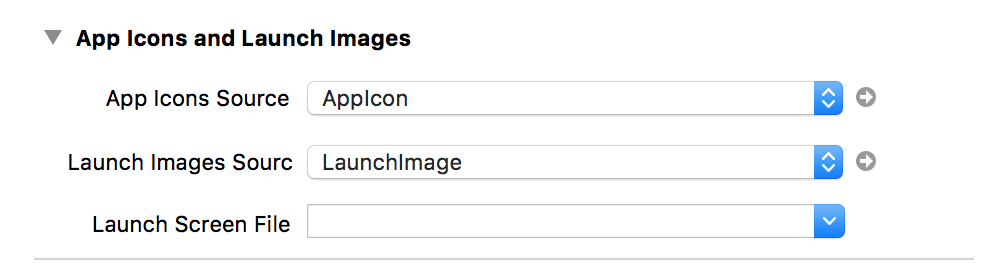
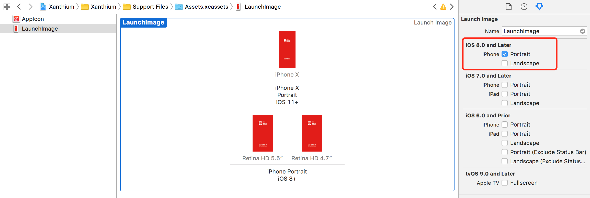

--
> 创建日期：2018年02月12日  
> 修改日期：2018年02月12日  

--
### iOS开发之不同iPhone的启动页适配

在 iPhone X 发布前，iOS 应用程序的启动页有两倍图和三倍图，一般使用工程里自动创建的 LaunchScreen.Storyboard 就可以了。iPhone X 发布后，iPhone X 的屏幕尺寸变长，这时无法很好的使用 LaunchScreen.storyboard 适配启动页。

> 之前我用过背景色加图片的方式，但是这种方式并不能解决启动页图片多色背景。 

使用 LaunchImage 可以很好的解决启动页适配问题。

##### 使用步骤

1)  选中工程->Target 删除 Launch Screen File 中的值，点击 Use Asset Catalogs ，弹出会话框

2)  点击 Migrate

3)  点击 Migrate 后，Launch Images Source会添加一个值，同时系统会在 Assets.xcassets 文件夹中创建一个 LaunchImage 文件夹

4)  选择工程中的 Assets.xcassets 文件夹中的 LaunchImage，在右侧工具栏中根据应用程序使用场景选择系统版本和屏幕方向，这里选择的是 iOS 8.0 and Later 仅 iPhone 竖屏。将不同屏幕的启动页图片对应拖拽到 LaunchImage 文件夹即可

