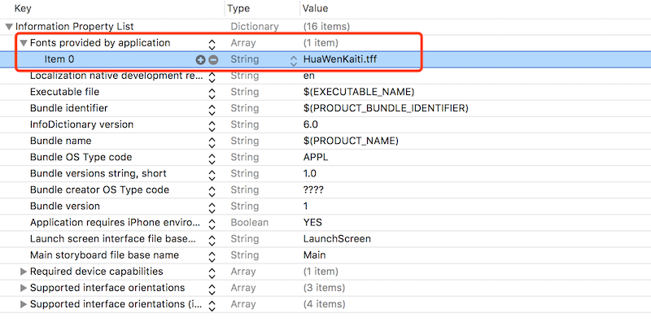
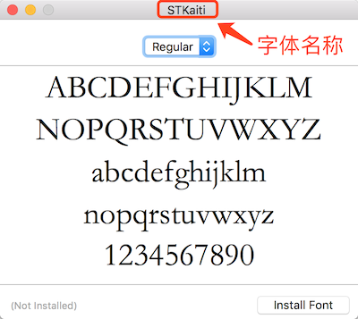

--
> 创建日期：2017年05月23日  
> 修改日期：2018年01月29日  

--
iOS系统中的字体共有75种，其中中文字体只有一种，就是黑体。如果在自己的app中使用其他字体，需要在app中添加自定义字体。

####准备字体包

添加的字体包可以直接在网上搜索下载，也可以自己做。字体包文件扩展名一般为.tff。

####添加字体包

在字体包准备好之后，打开项目，直接将字体包拖入项目目录中；也可以将字体包拷贝到项目文件夹下，然后在打开的项目中添加文件引用。

####修改Info.plist文件

打开项目Info.plist文件，添加新的项，名称选择**Fonts provided by application**，其值为字体包文件名称且需要包括文件扩展名。


这样就成功的添加了自定义字体，但是如何使用添加的自定义字体呢？

####获取字体名称

系统使用时需要获取字体的字体名称（不是字体文件名称）。在Mac下直接双击字体，可以查看字体名称。


也可以在系统中输出系统所有字体，查找字体名称。

```objc
NSArray * fontArrays = [[NSArray alloc]initWithArray:[UIFont familyNames]];
for (NSString *font in fontArrays) {
    NSLog(@"----%d Font name  = %@",i++,font);//输出所有字体，包括75种系统字体
}
```

####使用自定义字体

根据字体名称直接设置字体。

```objc
[UIFont fontWithName:@"STKaiti" size:30];//华文楷体
```


